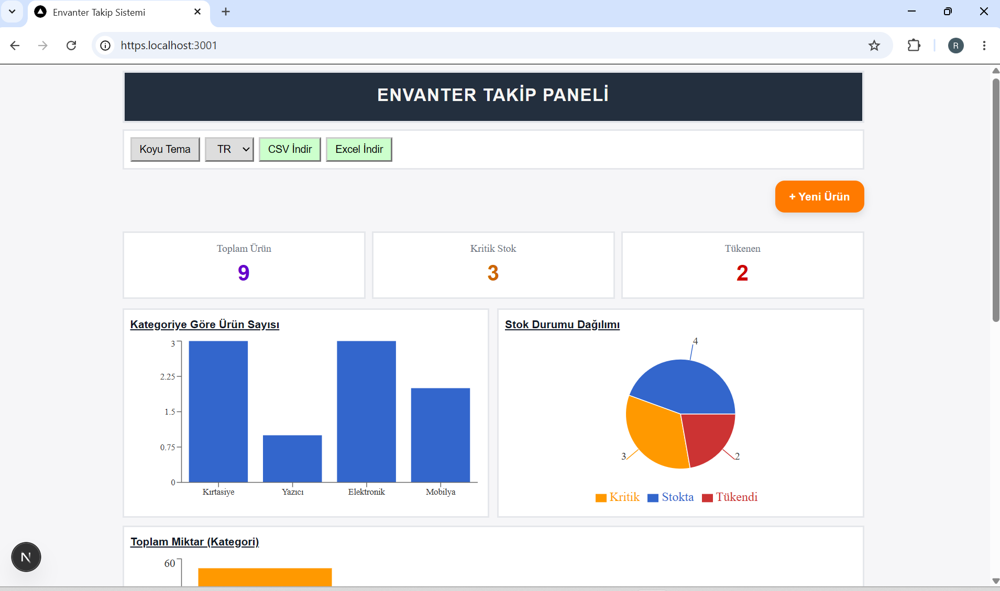
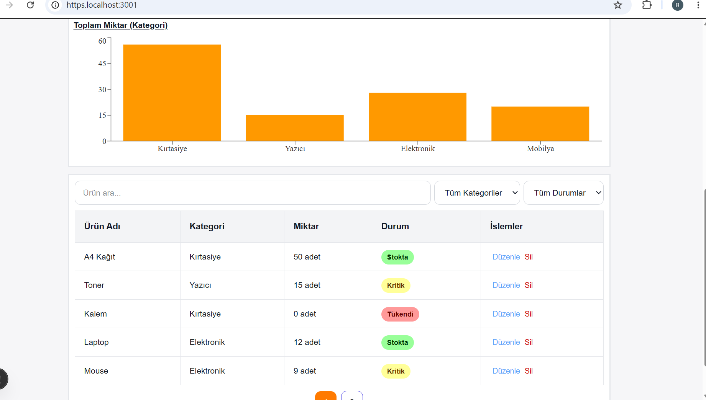
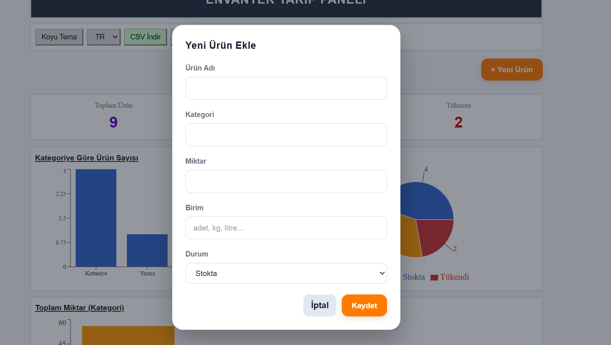
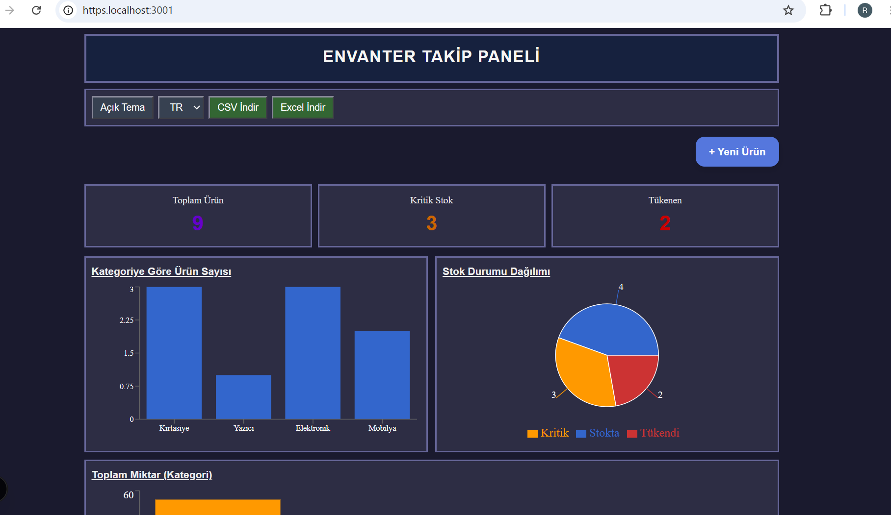

#  Envanter Takip Paneli

Modern ve kullanıcı dostu bir envanter takip sistemi.  
Bu proje Next.js ve TypeScript kullanılarak geliştirilmiştir.


#  Özellikler

- Ürün ekleme
- Ürün silme
- Ürün güncelleme
- Kategori filtreleme
- Stok durumu kontrolü
- Grafik destekli dashboard
- Koyu / Açık tema desteği
- Türkçe / İngilizce dil desteği
- CSV dışa aktarma
- Excel dışa aktarma
- Responsive tasarım


#  Kullanılan Teknolojiler


- Next.js
- React
- TypeScript
- CSS
- Recharts
- Context API


#  Proje Yapısı


src/
 ├── app/            → Sayfa yapıları ve global stiller
 ├── components/     → Ortak bileşenler
 ├── features/       → Ürün işlemleri ve modüller
 ├── lib/            → Tema ve dil yönetimi
 └── shared/         → Ortak yardımcı yapılar

public/              → Görseller ve statik dosyalar


#  Ekran Görüntüleri

## Ana Panel




## Açık Tema




## Koyu Tema




## Ürün Tablosu




## Kurulum

Projeyi çalıştırmak için:

```bash
npm install
npm run dev

Tarayıcıda aşağıdaki adresi açın:
http://localhost:3000

Geliştirici
Rümeysa Demir

Not
Bu proje eğitim amaçlı geliştirilmiştir.